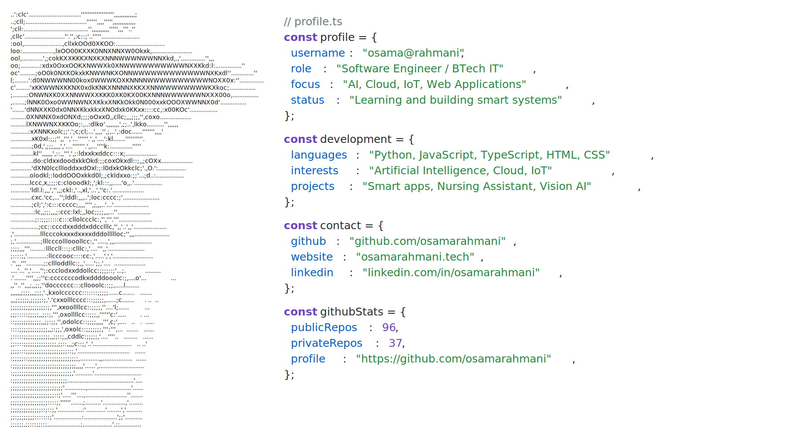

<p align="center">
  <a href="https://github.com/osamarahmani">
    <picture>
      <source
        media="(prefers-color-scheme: dark)"
        srcset="./profile-dark.svg"
      >
      
    </picture>
  </a>
</p>

# Automatic ASCII Profile SVG

A dependency-free Node.js generator for an editable developer profile in light
and dark SVG themes.

## Requirements

- Node.js 18 or newer
- `jp2a`
- A GitHub token for local live-data generation
- VS Code (optional)

On Ubuntu or Debian, install `jp2a` with:

```bash
sudo apt install jp2a
```

## Convert your photo

Place `myimg.jpeg` in this project folder, then run:

```bash
npm run portrait
```

This converts the photo into `ascii.txt`. When `GITHUB_TOKEN`, `GH_TOKEN`, or a
valid GitHub CLI login is available, it also regenerates the SVG files.

You can also use another image or choose the portrait width:

```bash
npm run portrait -- photo.png
npm run portrait -- photo.png --width=80
```

Widths from 20 to 150 are accepted. A larger width adds detail but uses more
horizontal space.

## Build

```bash
npm run build
```

Local generation fetches live GitHub data. Authenticate with the GitHub CLI:

```bash
gh auth login
npm run generate
```

The generated files are:

```text
profile-light.svg
profile-dark.svg
dist/profile-light.svg
dist/profile-dark.svg
```

Edit [`profile.json`](profile.json) to change the profile information. You can
also edit [`ascii.txt`](ascii.txt) manually and then rebuild.

The root-level files are displayed by this profile README. The `dist` copies are
provided for local previewing.

## Automatic updates

The [GitHub Actions workflow](.github/workflows/update-profile.yml) fetches:

- Public repository, follower, and following counts
- Stars received across non-fork public repositories
- Commits authored across non-fork public repositories
- Most-used languages
- Up to six pinned repositories

It runs every six hours, on relevant changes to `main`, or manually through the
Actions tab. GitHub's built-in `GITHUB_TOKEN` is used; no custom repository
secret is required.

## VS Code shortcut

Press <kbd>Ctrl</kbd>+<kbd>Shift</kbd>+<kbd>B</kbd> to run the included default
build task.

## Project structure

```text
.
├── ascii.txt
├── convert-image.mjs
├── profile.json
├── generate.mjs
├── package.json
├── README.md
├── profile-light.svg
├── profile-dark.svg
├── .vscode/
│   └── tasks.json
├── .github/
│   └── workflows/
│       └── update-profile.yml
└── dist/
    ├── profile-light.svg
    └── profile-dark.svg
```
